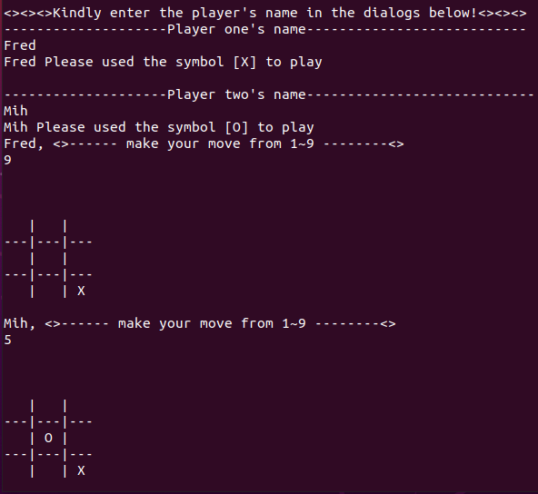

# The Tic-Tac-Toe Game

This game is build with Ruby to be played in the command terminal



## Tic Tac Toe

In order to win the game, a player must place three of their marks in a horizontal, vertical, or diagonal row.

The following example game is played by player Fred [X] and player Mih [O]:
The game is won by Fred [X].


Read more about Tic-Tac-Toe game at [Wikipedia](https://en.wikipedia.org/wiki/Tic-tac-toe)

## Built With
#### Ruby

## Environment set up requirements

To run this game, you need ruby installed in your environment.
Run the following command:

```
$ ruby -v
```

You should have a result similar to this:

```
ruby 2.6.5p114 (2019-10-01 revision 67812) [x86_64-linux]
```

If you don't get that result, follow this [link](https://www.ruby-lang.org/en/documentation/installation/) and install Ruby in your local environment.

## Getting Started

To get a local copy up and running follow these simple example steps in your terminal.

- `git clone https://github.com/FrederickMih/tic-tac-toe-game`
- `cd tic-tac-toe-game`
- `bin/main.rb`

## Instructions

1. To start the game, type `bin/main.rb`
2. Enter the player's names
3. Input the number from 1 to 9 to get the position where you want to take
4. Taking turns to play the game with step 3 and 4
5. If either player take 3 grids vertically, horizontally or diagonally first, the player is the winner
6. If neither player can take 3 grids until the board is filled with players' symbols, the game is a draw
7. If you want to play again, type `yes`, otherwise, type `no` to quit the game


## Author

👤 **Mih Frederick Mih**

- GitHub: [@FrederickMih](https://github.com/FrederickMih)
- Twitter: [@MihFrederick](https://twitter.com/MihFrederick)
- LinkedIn: [LinkedIn](https://www.linkedin.com/in/fred-mih-495bb31a2/)

👤 **PRABHAKAR PANDEY**

- Github: [@Prabhakarzx](https://github.com/Prabhakarzx)
- Twitter: [@Prabhakarzx](https://twitter.com/prabhakarzx)
- Linkedin: [@Prabhakarzx](https://www.linkedin.com/in/prabhakarzx/)

## 🤝 Contributing

Contributions, issues, and feature requests are welcome!

## Show your support

Give a ⭐️ if you like this project!

## 📝 License

Copyright 2020 Mih Frederick Ngum

Permission is hereby granted, free of charge, to any person obtaining a copy of this software and associated documentation files (the "Software"), to deal in the Software without restriction, including without limitation the rights to use, copy, modify, merge, publish, distribute, sublicense, and/or sell copies of the Software, and to permit persons to whom the Software is furnished to do so, subject to the following conditions:

The above copyright notice and this permission notice shall be included in all copies or substantial portions of the Software.

THE SOFTWARE IS PROVIDED "AS IS", WITHOUT WARRANTY OF ANY KIND, EXPRESS OR IMPLIED, INCLUDING BUT NOT LIMITED TO THE WARRANTIES OF MERCHANTABILITY, FITNESS FOR A PARTICULAR PURPOSE AND NONINFRINGEMENT. IN NO EVENT SHALL THE AUTHORS OR COPYRIGHT HOLDERS BE LIABLE FOR ANY CLAIM, DAMAGES OR OTHER LIABILITY, WHETHER IN AN ACTION OF CONTRACT, TORT OR OTHERWISE, ARISING FROM, OUT OF OR IN CONNECTION WITH THE SOFTWARE OR THE USE OR OTHER DEALINGS IN THE SOFTWARE.